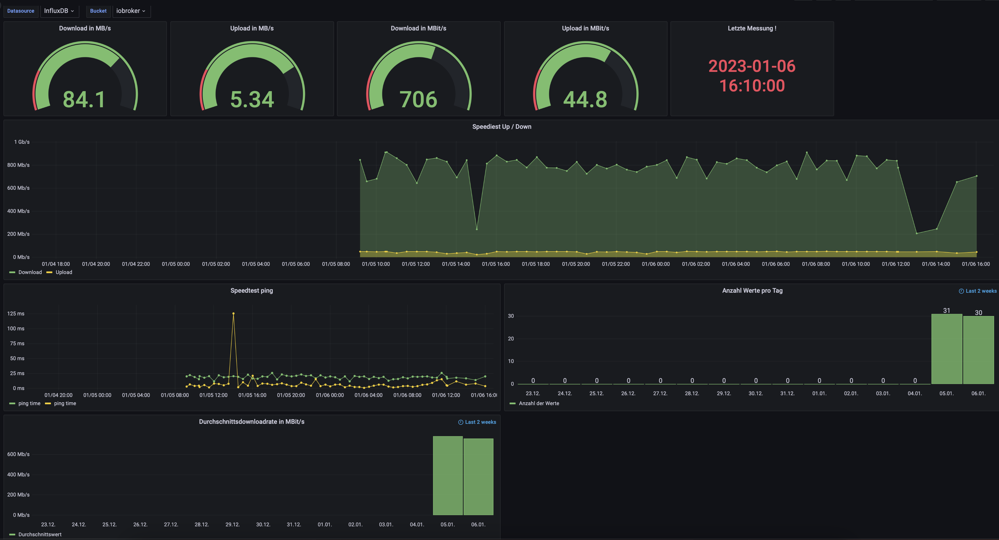

## Known issues

please provide an issue

## Description

This dashboard gives an overview about the speedtest which is configured in iobroker. The preconditions please see below

## Installation / preconditions

1. Grafana version >7
2. InfluxDB version >2
3. InfluxDB is correctly installed and working in iobroker
4. Speedtest cli is installed on iobroker client --> [please find here official documentation](https://www.speedtest.net/apps/cli#ubuntu)
5. [javascript is correctly installed and configured from here](https://www.kreyenborg.koeln/speedtest-fuer-iobroker/)

Now:

6. Influx database is configured in Grafana with FLUX !!!
7. Load the speedtest.json from here
8. Go into Grafana under DASHBOARDS / IMPORT and load via Upload JSON file
9. Click LOAD and your dashboard should appear !
10. Please select correct DATABASE and BUCKET --> values should appear !

## Changelog

* 0.0.1 - first version (06.01.2022)